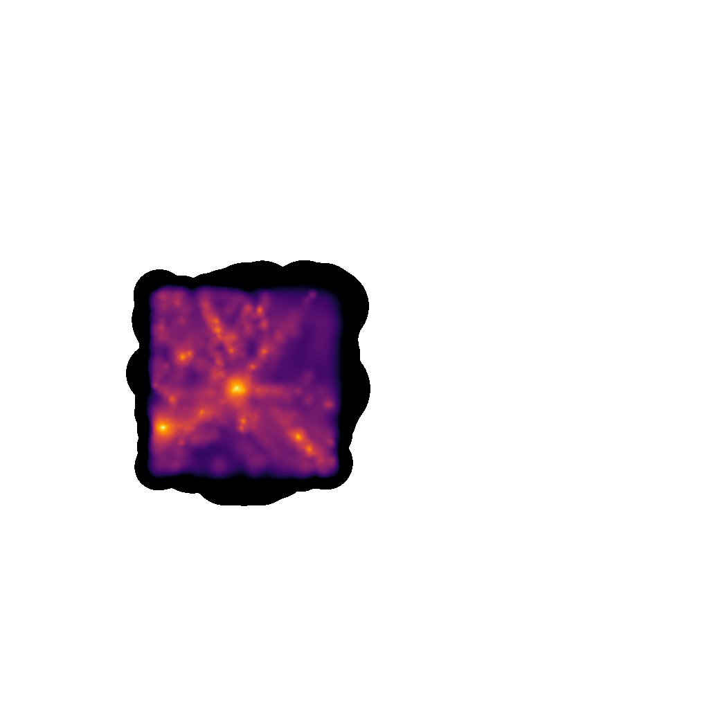
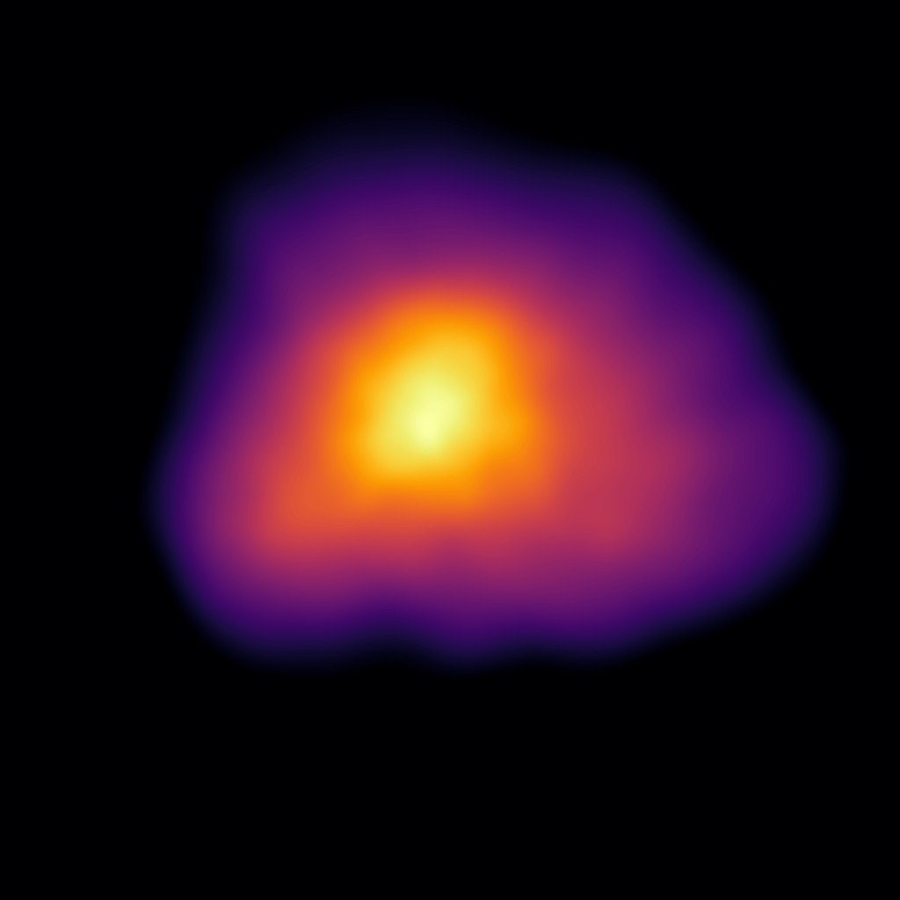
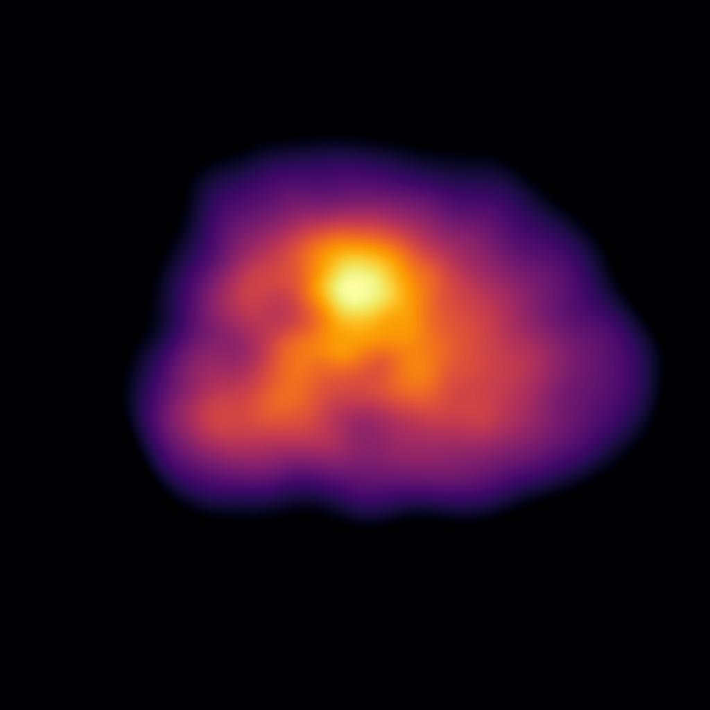

VELOCIraptor Integration
========================

:mod:`swiftsimio` can be used with the :mod:`velociraptor` library
to extract the particles contained within a given halo and its surrounding
region.

The :mod:`velociraptor` library has documentation also available on
ReadTheDocs `here <http://velociraptor-python.readthedocs.org/>`_. It can
be installed from PyPI using ``pip install velociraptor``.

The overarching workflow for this integration is as follows:

+ Load the halo catalogue and groups file using the :mod:`velociraptor`
  module.
+ Get two objects, corresponding to the bound and unbound particles,
  for a halo.
+ Use the `to_swiftsimio_dataset` to load the region around the halo
  with our ahead-of-time masking technique.
+ Use the region around the halo directly, or use the mask provided
  for each particle type to only consider bound particles.

This workflow is explored below. You can use the example data available
below if you do not have any SWIFT and VELOCIraptor data available.

``http://virgodb.cosma.dur.ac.uk/swift-webstorage/IOExamples/small_cosmo_volume.zip``

Example
-------

First, we must load the VELOCIraptor catalogue as follows:

.. code-block:: python

    from velociraptor import load as load_catalogue
    from velociraptor.particles import load_groups

    catalogue_name = "velociraptor"
    snapshot_name = "snapshot"

    catalogue = load_catalogue(f"{catalogue_name}.properties")
    groups = load_groups(f"{catalogue_name}.catalog_groups", catalogue=catalogue)

Then, to extract the largest halo in the volume

.. code-block:: python

    particles, unbound_particles = groups.extract_halo(halo_id=0)

To load the particles to a :mod:`swiftsimio` dataset,

.. code-block:: python

    from velociraptor.swift.swift import to_swiftsimio_dataset

    data, mask = to_swiftsimio_dataset(
        particles,
        f"{snapshot_name}.hdf5",
        generate_extra_mask=True
    )

with the ``generate_extra_mask`` providing the second return value which
is a mask to extract only the bound particles in the system.

Making an image of the full box shows that only a small subsection of the
volume has been loaded (those within twice the maximal usable radius within
VELOCIraptor)

The code for making this image is as follows:

.. code-block:: python

    from swiftsimio.visualisation import project_gas_pixel_grid
    import matplotlib.pyplot as plt
    from matplotlib.colors import LogNorm
    
    grid = project_gas_pixel_grid(data=data, resolution=1024)
    
    fig, ax = plt.subplots(figsize=(4, 4), dpi=1024 // 4)
    fig.subplots_adjust(0, 0, 1, 1)
    ax.axis("off")
    ax.imshow(grid.T, origin="lower", cmap="inferno", norm=LogNorm(vmin=1e4, clip=True))
    fig.savefig("load_halo_fullbox.png")

To make an image of just the central halo, we can access properties on the
``particles`` instance to get the position of the halo.

.. code-block:: python

    region = [
        particles.x_mbp - particles.r_200crit, particles.x_mbp + particles.r_200crit,
        particles.y_mbp - particles.r_200crit, particles.y_mbp + particles.r_200crit,
    ]

    grid = project_gas_pixel_grid(data=data, resolution=1024, region=region)

    fig, ax = plt.subplots(figsize=(4, 4), dpi=1024 // 4)
    fig.subplots_adjust(0, 0, 1, 1)
    ax.axis("off")
    ax.imshow(grid.T, origin="lower", cmap="inferno", norm=LogNorm(vmin=1e4, clip=True))
    fig.savefig("load_halo_selection.png")

This produces the following image:

Then, finally, we can visualise only the bound particles, through the use of the ``mask``
object that was returned when we initially extracted the ``swiftsimio`` dataset:

.. code-block:: python

    grid = project_gas_pixel_grid(data=data, resolution=1024, region=region, mask=mask.gas)

    fig, ax = plt.subplots(figsize=(4, 4), dpi=1024 // 4)
    fig.subplots_adjust(0, 0, 1, 1)
    ax.axis("off")
    ax.imshow(grid.T, origin="lower", cmap="inferno", norm=LogNorm(vmin=1e4, clip=True))
    fig.savefig("load_halo_bound_selection.png")

Producing the following image:

Hopefully, when you use this feature, you have more exciting data to use than the
as-small-as-possible example that we show here!