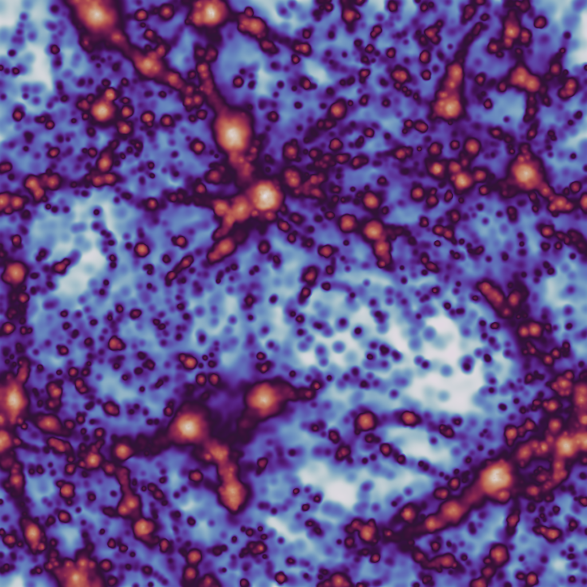
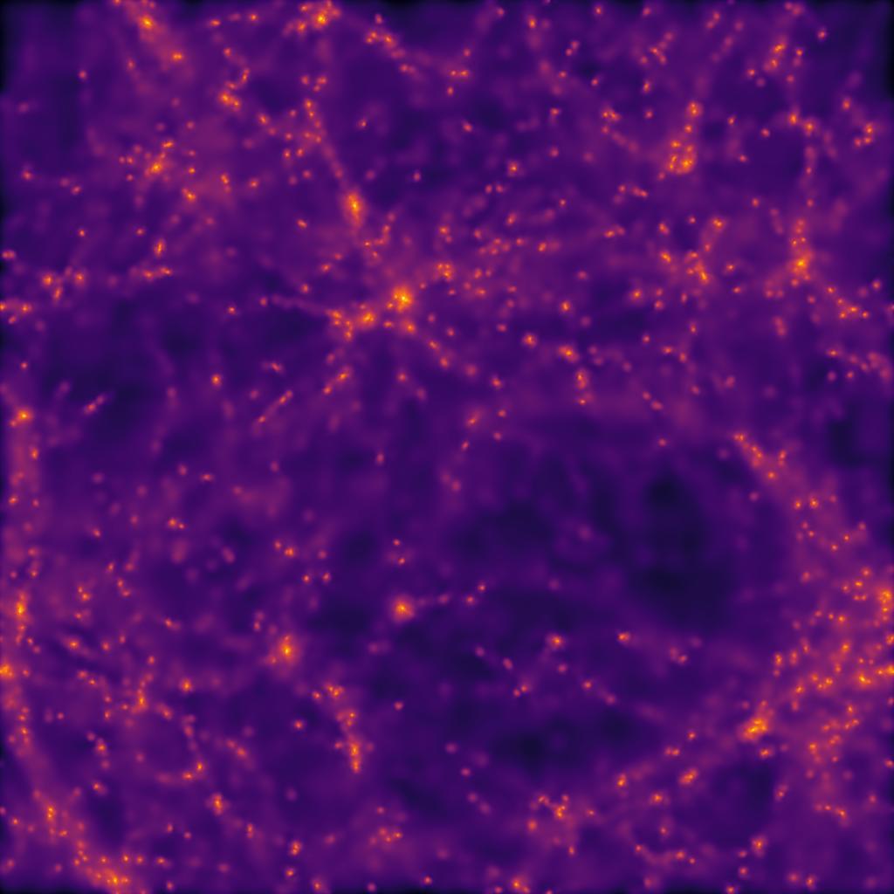

Projection
==========

The :mod:`swiftsimio.visualisation.projection` sub-module provides an interface
to render SWIFT data projected to a grid. This takes your 3D data and projects
it down to 2D, such that if you request masses to be smoothed then these
functions return a surface density.

This effectively solves the equation:

:math:`\tilde{A}_i = \sum_j A_j W_{ij, 2D}`

with :math:`\tilde{A}_i` the smoothed quantity in pixel :math:`i`, and
:math:`j` all particles in the simulation, with :math:`W` the 2D kernel.
Here we use the Wendland-C2 kernel.

The primary function here is
:func:`swiftsimio.visualisation.projection.project_gas`, which allows you to
create a gas projection of any field. See the example below.

Example
-------

.. code-block:: python

   from swiftsimio import load
   from swiftsimio.visualisation.projection import project_gas

   data = load("cosmo_volume_example.hdf5")

   # This creates a grid that has units msun / Mpc^2, and can be transformed like
   # any other cosmo_array
   mass_map = project_gas(
       data,
       resolution=1024,
       project="masses",
       parallel=True,
       periodic=True,
   )

   # Let's say we wish to save it as msun / kpc^2 (physical, not comoving),
   from unyt import msun, kpc
   from matplotlib.pyplot import imsave
   from matplotlib.colors import LogNorm

   # Normalize and save
   imsave(
       "gas_surface_dens_map.png",
       LogNorm()(mass_map.to_physical_value(msun / kpc**2)),
       cmap="viridis",
   )

This basic demonstration creates a mass surface density map.

To create, for example, a projected temperature map, we need to remove the
surface density dependence (i.e. :func:`~swiftsimio.visualisation.projection.project_gas`
returns a surface temperature in units of K / kpc^2 and we just want K) by dividing out by
this:

.. code-block:: python

   from swiftsimio import load
   from swiftsimio.visualisation.projection import project_gas

   data = load("cosmo_volume_example.hdf5")

   # First create a mass-weighted temperature dataset
   data.gas.mass_weighted_temps = data.gas.masses * data.gas.temperatures

   # Map in msun / mpc^2
   mass_map = project_gas(
       data,
       resolution=1024,
       project="masses",
       parallel=True,
       periodic=True,
   )
   # Map in msun * K / mpc^2
   mass_weighted_temp_map = project_gas(
       data,
       resolution=1024,
       project="mass_weighted_temps",
       parallel=True,
       periodic=True,
   )

   temp_map = mass_weighted_temp_map / mass_map

   from unyt import K
   from matplotlib.pyplot import imsave
   from matplotlib.colors import LogNorm

   # Normalize and save
   imsave(
       "temp_map.png",
       LogNorm()(temp_map.to_physical_value(K)),
       cmap="twilight",
   )

The output from this example, when used with the example data provided in the
loading data section should look something like:

Periodic boundaries
-------------------

Cosmological simulations and many other simulations use periodic boundary
conditions. This has implications for the particles at the edge of the
simulation box: they can contribute to pixels on multiple sides of the image.
If this effect is not taken into account, then the pixels close to the edge
will have values that are too low because of missing contributions.

All visualisation functions by default assume a periodic box. Rather than
simply projecting each individual particle once, four additional periodic copies
of each particle are also projected. Most copies will project outside the valid
pixel range, but the copies that do not ensure that pixels close to the edge
receive all necessary contributions. Thanks to :mod:`numba` optimisations, the overhead
of these additional copies is relatively small.

There are some caveats with this approach. If you try to visualise a subset of
the particles in the box (e.g. using a mask), then only periodic copies of
particles in this subset will be used. If the subset does not include particles
on the other side of the periodic boundary, then these will still be missing
from the projection. The same is true if you visualise a region of the box.
The periodic boundary wrapping is also not compatible with rotations (see below)
and should therefore not be used together with a rotation.

Rotations
---------

Sometimes you will need to visualise a galaxy from a different perspective.
The :mod:`swiftsimio.visualisation.rotation` sub-module provides routines to
generate rotation matrices corresponding to vectors, which can then be
provided to the ``rotation_matrix`` argument of
:func:`~swiftsimio.visualisation.projection.project_gas` (and
:func:`~swiftsimio.visualisation.projection.project_pixel_grid`). You will also need
to supply the ``rotation_center`` argument, as the rotation takes place around this given
point. The example code below loads a snapshot, and a halo catalogue, and
creates an edge-on and face-on projection using the integration in
``velociraptor``. More information on possible integrations with this library
is shown in the ``velociraptor`` section.

.. code-block:: python

   from swiftsimio import load, mask, cosmo_array
   from velociraptor import load as load_catalogue
   from swiftsimio.visualisation.rotation import rotation_matrix_from_vector
   from swiftsimio.visualisation.projection import project_gas

   import unyt
   import numpy as np

   # Radius around which to load data, we will visualise half of this
   size = 1000 * unyt.kpc

   snapshot_filename = "cosmo_volume_example.hdf5"
   catalogue_filename = "cosmo_volume_example.properties"

   catalogue = load_catalogue(catalogue_filename)

   # Which halo should we visualise?
   halo = 0

   x = catalogue.positions.xcmbp[halo]
   y = catalogue.positions.ycmbp[halo]
   z = catalogue.positions.zcmbp[halo]

   lx = catalogue.angular_momentum.lx[halo]
   ly = catalogue.angular_momentum.ly[halo]
   lz = catalogue.angular_momentum.lz[halo]

   # The angular momentum vector will point perpendicular to the galaxy disk.
   # If your simulation contains stars, use lx_star
   angular_momentum_vector = cosmo_array([lx, ly, lz])
   angular_momentum_vector /= np.linalg.norm(angular_momentum_vector)

   face_on_rotation_matrix = rotation_matrix_from_vector(angular_momentum_vector)
   edge_on_rotation_matrix = rotation_matrix_from_vector(
       angular_momentum_vector, axis="y"
   )

   data_mask = mask(snapshot_filename)
   region = cosmo_array(
       [
           [x - size, x + size],
           [y - size, y + size],
           [z - size, z + size],
       ],
       x.units,
       comoving=True,
       scale_factor=data_mask.metadata.a,
       scale_exponent=1,
   )

   visualise_region = cosmo_array(
       [
           x - 0.5 * size,
           x + 0.5 * size,
           y - 0.5 * size,
           y + 0.5 * size,
       ],
       comoving=True,
       scale_factor=data_mask.metadata.a,
       scale_exponent=1,
   )

   data_mask.constrain_spatial(region)
   data = load(snapshot_filename, mask=data_mask)

   # Use project_pixel_grid to generate projected images

   common_arguments = dict(
       data=data,
       resolution=512,
       parallel=True,
       region=visualise_region,
       periodic=False,  # disable periodic boundaries when using rotations
   )

   un_rotated = project_gas(**common_arguments)

   rotation_center = cosmo_array(
       [x, y, z], comoving=True, scale_factor=data_mask.metadata.a, scale_exponent=1
   )
   face_on = project_gas(
       **common_arguments,
       rotation_center=rotation_center,
       rotation_matrix=face_on_rotation_matrix,
   )

   edge_on = project_gas(
       **common_arguments,
       rotation_center=rotation_center,
       rotation_matrix=edge_on_rotation_matrix,
   )

Using this with the provided example data will just show blobs due to its low resolution
nature. Using one of the EAGLE volumes (``examples/EAGLE_ICs``) will produce much nicer
galaxies, but that data is too large to provide as an example in this tutorial.

You can also provide an extra two values, the z min and max, as part of the
``region`` parameter. This may have some slight performance impact, so it is
generally advised that you do this on sub-loaded volumes only.

Masking
-------

Sometimes you want to render only a subset of a snapshot's data, for example
just particles belonging to a given friends-of-friends group.
To achieve this, you can provide a boolean mask to
:func:`~swiftsimio.visualisation.projection.project_pixel_grid` or
:func:`~swiftsimio.visualisation.projection.project_gas` to render only the
particles which the mask specifies.

.. code-block:: python

   from swiftsimio import load, mask, cosmo_array
   from swiftsimio.visualisation.projection import project_gas

   snapshot_filename = "cosmo_volume_example.hdf5"
   catalog_filename = "fof_output_example.hdf5"

   # Which halo are we looking at?
   halo = 0

   fof_catalog = load(catalog_filename)

   fof_id = fof_catalog.fof_groups.group_ids[halo]
   fof_radius = fof_catalog.fof_groups.radii[halo]
   fof_centre = fof_catalog.fof_groups.centres[halo]

   # Add some buffer space around the edges
   fof_radius *= 1.1

   # Define a region around the fof group
   region = cosmo_array(
       [
           [fof_centre[0] - fof_radius, fof_centre[0] + fof_radius],
           [fof_centre[1] - fof_radius, fof_centre[1] + fof_radius],
           [fof_centre[2] - fof_radius, fof_centre[2] + fof_radius],
       ],
       fof_centre.units,
       comoving=True,
       scale_factor=fof_catalog.metadata.a,
       scale_exponent=1,
   )

   # Only load data in our region of interest
   data_mask = mask(snapshot_filename)
   data_mask.constrain_spatial(region)

   data = load(snapshot_filename, mask=data_mask)

   halo_map = project_gas(
       data,
       resolution=512,
       parallel=True,
       region=region.ravel(),
       periodic=True,
       mask=data.gas.fofgroup_id == fof_id, # Only render particles in the group
   )

Other particle types
--------------------

Other particle types are able to be visualised through the use of the
:func:`swiftsimio.visualisation.projection.project_pixel_grid` function.

To use this feature for particle types that do not have smoothing lengths, you
will need to generate them, as in the example below where we create a
mass density map for dark matter. We provide a utility to do this through
:func:`~swiftsimio.visualisation.smoothing_length.generate.generate_smoothing_lengths`.

.. code-block:: python

   from swiftsimio import load
   from swiftsimio.visualisation.projection import project_pixel_grid
   from swiftsimio.visualisation.smoothing_length import generate_smoothing_lengths

   data = load("cosmo_volume_example.hdf5")

   # Generate smoothing lengths for the dark matter
   data.dark_matter.smoothing_length = generate_smoothing_lengths(
       data.dark_matter.coordinates,
       data.metadata.boxsize,
       kernel_gamma=1.8,
       neighbours=57,
       speedup_fac=2,
       dimension=3,
   )

   # Project the dark matter mass
   dm_mass = project_pixel_grid(
       # Note here that we pass in the dark matter dataset not the whole
       # data object, to specify what particle type we wish to visualise
       data=data.dark_matter,
       resolution=1024,
       project="masses",
       parallel=True,
       region=None,
       periodic=True,
   )

   from matplotlib.pyplot import imsave
   from matplotlib.colors import LogNorm

   # Everyone knows that dark matter is purple
   imsave("dm_mass_map.png", LogNorm()(dm_mass), cmap="inferno")

The output from this example, when used with the example data provided in the
loading data section should look something like:

Backends
--------

In certain cases, rather than just using this facility for visualisation, you
will wish that the values that are returned to be as well converged as
possible. For this, we provide several different backends. These are passed
as ``backend="str"`` to all of the projection visualisation functions, and
are available in the module
:mod:`swiftsimio.visualisation.projection.projection_backends`. The available
backends are as follows:

+ ``fast``: The default backend - this is extremely fast, and provides very basic
  smoothing, with a return type of single precision floating point numbers.
+ ``histogram``: This backend provides zero smoothing, and acts in a similar way
  to the :func:`~numpy.histogram2d` function but with the same arguments as ``scatter``.
+ ``reference``: The same backend as ``fast`` but with two distinguishing features:
  all calculations are performed in double precision, and it will return early
  with a warning message if there are not enough pixels to fully resolve each kernel.
  Intended for developer usage, regular users should not use this mode.
+ ``renormalised``: The same as ``fast``, but each kernel is evaluated twice and
  renormalised to ensure mass conservation within floating point precision. Returns
  single precision arrays.
+ ``subsampled``: This is the recommended mode for users who wish to have converged
  results even at low resolution. Each kernel is evaluated at least 32 times, with
  overlaps between pixels considered for every single particle. Returns in
  double precision.
+ ``subsampled_extreme``: The same as ``subsampled``, but provides 64 kernel
  evaluations.
+ ``nested``: A nested multi-resolution backend that scatters particles with
  large smoothing lengths onto coarser grids and bilinearly upsamples the result,
  following the Sparse Multi-Scale Grid approach described in
  `Benítez-Llambay (2025)`_. This bounds the cost per particle regardless of
  smoothing length, so it is much faster than ``fast`` for simulations with a
  wide range of smoothing lengths. Takes the optional ``ntarget`` and
  ``nlevels`` arguments; ``resolution`` must be divisible by ``2**nlevels``.
  See `Nested multi-resolution backend`_ below for details.
+ ``gpu``: The same as ``fast`` but uses CUDA for faster computation on supported
  GPUs. The parallel implementation is the same function as the non-parallel.

Example:

.. code-block:: python

   from swiftsimio import load
   from swiftsimio.visualisation.projection import project_gas

   data = load("cosmo_volume_example.hdf5")

   subsampled_array = project_gas(
      data,
      resolution=1024,
      project="entropies",
      parallel=True,
      backend="subsampled",
      periodic=True,
   )

This will likely look very similar to the image that you make with the default
``backend="fast"``, but will have a well-converged distribution at any resolution
level.

Nested multi-resolution backend
~~~~~~~~~~~~~~~~~~~~~~~~~~~~~~~

Motivation
^^^^^^^^^^

In the ``fast`` backend (and all the other smoothing backends) every particle
visits every pixel within its kernel compact-support radius. For a particle
whose kernel spans :math:`N` pixels along each axis the cost is
:math:`\mathcal{O}(N^2)`. Simulations with a large dynamic range in smoothing
length — zoom-in simulations, or cosmological volumes containing both dense
haloes and the diffuse IGM — contain particles whose kernels span tens to
hundreds of pixels at typical image resolutions. These few large particles can
dominate the total projection time even though they are a tiny fraction of the
particle count, and the problem gets worse as the image resolution increases.

The ``nested`` backend bounds the per-particle cost at
:math:`\mathcal{O}(n_\mathrm{target}^2)` regardless of smoothing length by
depositing large particles onto coarser grids and bilinearly upsampling the
result back to the requested resolution afterwards. This follows the Sparse
Multi-Scale Grid approach described in `Benítez-Llambay (2025)`_. The same
algorithm is available for volume renders (see :doc:`volume_render`).

Basic usage
^^^^^^^^^^^

Pass ``backend="nested"`` to :func:`~swiftsimio.visualisation.projection.project_gas`
or :func:`~swiftsimio.visualisation.projection.project_pixel_grid`. Two extra
optional arguments control the hierarchy:

.. code-block:: python

   from swiftsimio import load
   from swiftsimio.visualisation.projection import project_gas

   data = load("cosmo_volume_example.hdf5")

   nested_array = project_gas(
      data,
      resolution=1024,
      project="masses",
      parallel=True,
      backend="nested",
      ntarget=6,  # target pixels per kernel diameter at each level
      nlevels=4,  # number of coarsening levels (requires resolution % 2**nlevels == 0)
      periodic=True,
   )

Both arguments are optional and default to ``ntarget=6`` and ``nlevels=4``.
Setting either of them with any other backend raises a ``UserWarning`` and
they are ignored. Everything else — regions, depth-limited projections,
rotations, masks and periodic wrapping — works exactly as for the other
backends.

Algorithm
^^^^^^^^^

The pipeline has four stages.

**1. Level assignment.**
For each particle, the number of finest-grid pixels spanned by its kernel
compact-support radius is estimated:

.. math::

   N_\mathrm{pix} = \gamma_k \, h \, r

where :math:`\gamma_k = 1.897367` is the 2D Wendland-C2 kernel gamma (the
same value used by the other projection backends) and :math:`r` is ``res``.
The particle is then assigned to hierarchy level :math:`L`:

.. math::

   L = \mathrm{clip}\!\left(\left\lceil \log_2 \frac{N_\mathrm{pix}}{n_\mathrm{target}} \right\rceil,\; 0,\; L_\mathrm{max}\right)

Level 0 is the finest grid (resolution ``res``); level :math:`L` uses a grid
of resolution :math:`r / 2^L`. At its assigned level every kernel spans
approximately ``ntarget`` pixels per axis. Particles with zero mass or a
negative smoothing length are skipped.

The hierarchy for ``res=1024``, ``nlevels=4`` looks like this::

   Level 0 (finest)    1024 × 1024   — small, well-resolved kernels
   Level 1              512 ×  512
   Level 2              256 ×  256
   Level 3              128 ×  128
   Level 4 (coarsest)    64 ×   64   — very large, diffuse kernels

**2. Scatter.**
Each particle is deposited onto its assigned level using the 2D Wendland-C2
kernel,

.. math::

   W(r, H) = \frac{7}{\pi H^2} \left(1 - \frac{r}{H}\right)^4 \left(1 + \frac{4r}{H}\right),
   \qquad H = \gamma_k h,

the same kernel used by the ``fast`` backend. Kernels smaller than half a
pixel at their level deposit their whole weight into the pixel that contains
them. Periodic wrapping is handled as in the other backends: a particle is
deposited once for each periodic image whose kernel overlaps ``[0, 1]``.
Level-0 particles write directly into the output image; coarser particles
write into a single flat array that stores all coarse levels back-to-back.

**3. Collapse.**
Once every particle has been deposited, the hierarchy is collapsed
coarse-to-fine (from level :math:`L_\mathrm{max}` down to level 1). Each
coarse grid is bilinearly upsampled by a factor of two and added to the next
finer grid. The upsampling stencil is::

   fine index 2i   draws 3/4 from coarse[i] and 1/4 from coarse[i-1]
   fine index 2i+1 draws 3/4 from coarse[i] and 1/4 from coarse[i+1]

applied independently along x and y. Only the bounding box of pixels that
actually received a contribution is upsampled at each level, so the collapse
cost scales approximately with the number of particles rather than the image
area.

**4. Return.**
The finest grid, which now contains the contributions from all levels, is
returned.

Accuracy
^^^^^^^^

The ``nested`` backend is an approximation. A particle at level
:math:`L > 0` is deposited onto a coarser grid and then spread over the fine
grid by bilinear upsampling, so the image it produces is the true kernel
convolved with the upsampling stencil. With the default ``ntarget=6``
individual pixels typically differ from the ``fast`` backend at the
few-percent level, with larger relative differences in faint pixels near the
edge of a kernel's support, which carry very little of the total. Setting
``ntarget`` large enough that every particle stays on level 0 reproduces the
``fast`` backend.

Neither backend renormalises its kernels, so integrated quantities are
conserved to about the same (percent-level) accuracy in both; use
``renormalised`` or ``subsampled`` if exact conservation matters more than
speed.

As in the volume-render case, rendering the same particles with different
region bounds or resolutions changes their normalised positions in the last
few bits of float64, and a particle very close to a pixel boundary can land in
a different pixel. This affects a small fraction of pixels.

Resolution constraint
^^^^^^^^^^^^^^^^^^^^^

Because each level coarsens by exactly a factor of two, ``resolution`` must be
divisible by :math:`2^{\text{nlevels}}`. With the default ``nlevels=4`` this
requires a multiple of 16 (e.g. 256, 512, 1024, 2048). An incompatible
combination raises a ``ValueError`` suggesting the nearest valid resolutions
and the largest ``nlevels`` that works with the requested one.

Memory usage
^^^^^^^^^^^^

The backend allocates the output image (:math:`r^2` float32 values) plus a
flat array holding all coarse levels, of total size

.. math::

   \sum_{L=1}^{L_\mathrm{max}} (r / 2^L)^2
   = r^2 \sum_{L=1}^{L_\mathrm{max}} 4^{-L}
   < \frac{r^2}{3},

so the footprint is less than :math:`4/3` of the output image, independent of
``nlevels``. Only levels that are actually occupied are allocated. In the
parallel implementation each thread holds a private copy of this allocation,
so peak memory scales with the number of threads, as for the other parallel
backends.

Performance
^^^^^^^^^^^

The speedup depends on how many particles have kernels much larger than
``ntarget`` pixels. For 200,000 particles with smoothing lengths spread
log-uniformly over nearly three decades, projected at ``resolution=1024``
with 32 threads, ``nested`` took 0.12 s against 1.2 s for ``fast``. For
data where all kernels are only a few pixels across, every particle stays on
level 0 and the two backends run at similar speeds.

When to use it
^^^^^^^^^^^^^^

Use ``nested`` when:

* The simulation has a wide dynamic range in smoothing length (zoom-in runs,
  cosmological boxes including the IGM, multi-phase ISM models).
* You are making high-resolution images, where large kernels span many pixels.
* A few-percent approximation in individual pixels is acceptable.

Prefer another backend when:

* You need exact per-pixel agreement with the reference kernel (``fast``,
  ``reference``) or converged results at low resolution (``subsampled``).
* The image resolution cannot be made divisible by ``2**nlevels``.

Choosing ``ntarget`` and ``nlevels``
^^^^^^^^^^^^^^^^^^^^^^^^^^^^^^^^^^^^

``ntarget`` controls how many pixels each kernel spans at its assigned level.
Higher values keep particles on finer grids (less upsampling, higher
accuracy) at the cost of more kernel evaluations per particle. The default of
``6`` is a good all-round choice; values of 4–10 cover the practical
speed/accuracy trade-off.

``nlevels`` sets the depth of the hierarchy. More levels let very large
kernels be placed on very coarse grids, giving bigger speedups for extremely
diffuse particles, at the cost of a stricter divisibility requirement on
``resolution``. The default of ``4`` is enough for most smoothing-length
distributions.

.. code-block:: python

   # Higher accuracy: fewer particles pushed to coarse levels.
   accurate = project_gas(data, resolution=2048, backend="nested", ntarget=10)

   # Maximum speed: deeper hierarchy, smaller ntarget.
   # Requires resolution divisible by 2**5 = 32.
   quick = project_gas(data, resolution=2048, backend="nested", ntarget=4, nlevels=5)

.. _Benítez-Llambay (2025): https://iopscience.iop.org/article/10.3847/2515-5172/addab2

Lower-level API
---------------

The lower-level API for projections allows for any general positions,
smoothing lengths, and smoothed quantities, to generate a pixel grid that
represents the smoothed version of the data.

This API is available through
:obj:`swiftsimio.visualisation.projection_backends.backends` and
:obj:`swiftsimio.visualisation.projection_backends.backends_parallel` for parallel
implementations. The parallel versions use significantly more memory as they allocate
a thread-local image array for each thread, summing them in the end. Here we
will only describe the ``fast`` variant, but they behave in the exact same way.

The default backend used by :mod:`swiftsimio` is ``fast``. To use the others (e.g.
``histogram``, ``subsampled``, ``gpu``, etc.), you can select them
manually from the module, or by using the ``backends`` and ``backends_parallel``
dictionaries in :mod:`swiftsimio.visualisation.projection_backends`.

To use these functions, you will need:

+ x-positions of all of your particles, ``x``.
+ y-positions of all of your particles, ``y``.
+ A quantity which you wish to smooth for all particles, such as their
  mass, ``m``.
+ Smoothing lengths for all particles, ``h``.
+ The resolution you wish to make your square image at, ``res``.

Optionally, you will also need:

+ the size of the simulation box in x and y, ``box_x`` and ``box_y``.

The key here is that only particles in the domain [0, 1] in x, and [0, 1] in y
will be visible in the image. You may have particles outside of this range;
they will not crash the code, and may even contribute to the image if their
smoothing lengths overlap with [0, 1]. You will need to re-scale your data
such that it lives within this range. You should also pass raw numpy arrays (not
:class:`~swiftsimio.objects.cosmo_array` or :class:`~unyt.array.unyt_array`, the
inputs are dimensionless). Then you may use the functions as follows:

.. code-block:: python

   from swiftsimio.visualisation.projection_backends import backends

   scatter = backends["fast"]
   # Using the variable names from above
   out = scatter(x=x, y=y, h=h, m=m, res=res)

   # The nested backend accepts the same arguments, plus ntarget and nlevels.
   out = backends["nested"](
       x=x,
       y=y,
       h=h,
       m=m,
       res=res,
       ntarget=6,
       nlevels=4,
   )

``out`` will be a 2D :class:`~numpy.ndarray` grid of shape ``[res, res]``. You will need
to re-scale this back to your original dimensions to get it in the correct units,
and do not forget that it now represents the smoothed quantity per surface area.

If the optional arguments ``box_x`` and ``box_y`` are provided, they should
contain the simulation box size in the same re-scaled coordinates as ``x`` and
``y``. The projection backend will then correctly apply periodic boundary
wrapping. If ``box_x`` and ``box_y`` are not provided or set to ``0``, no
periodic boundaries are applied.
