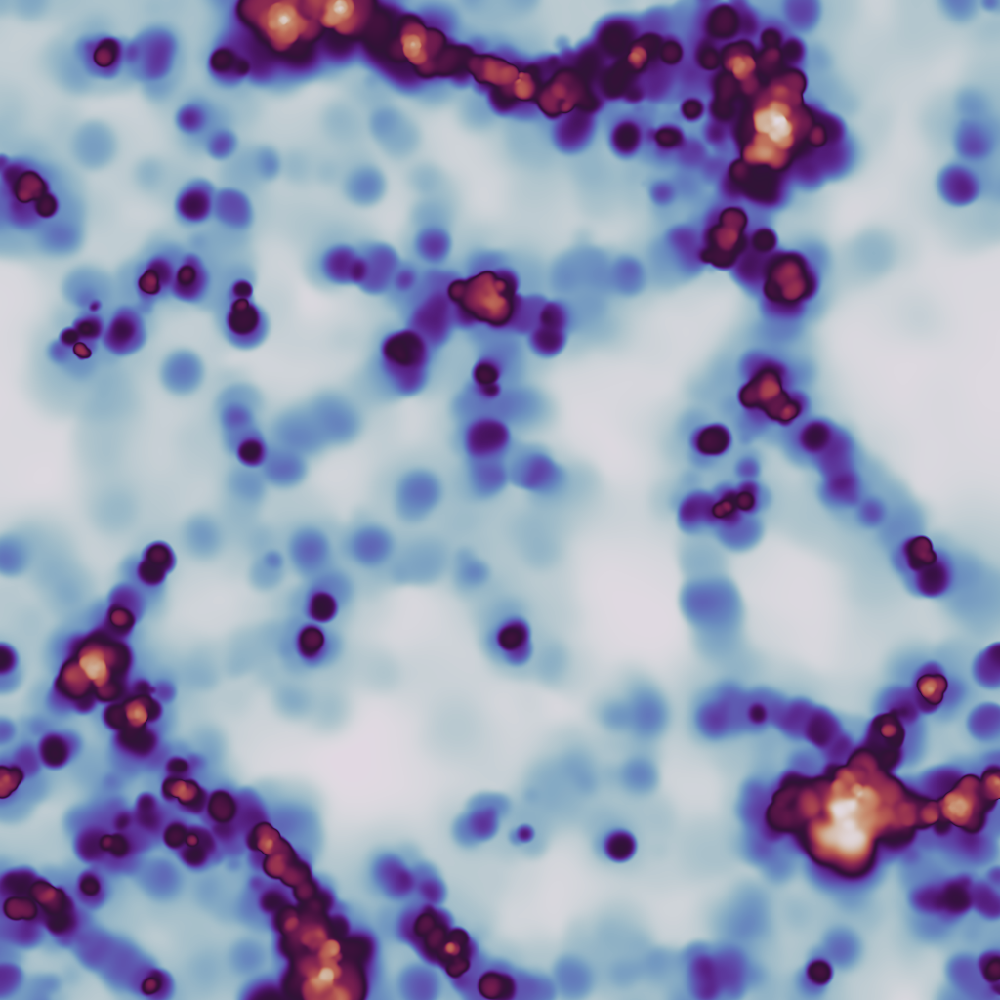

Slices
======

The :mod:`swiftsimio.visualisation.slice` sub-module provides an interface
to render SWIFT data onto a slice. This takes your 3D data and finds the 3D
density at fixed z-position, slicing through the box.

The default :code:`"sph"` backend effectively solves the equation:

:math:`\tilde{A}_i = \sum_j A_j W_{ij, 3D}`

with :math:`\tilde{A}_i` the smoothed quantity in pixel :math:`i`, and
:math:`j` all particles in the simulation, with :math:`W` the 3D kernel.
Here we use the Wendland-C2 kernel. Note that here we take the kernel
at a fixed z-position.

There is also an alternative :code:`"nearest_neighbors"` backend, which uses
nearest-neighbor interpolation to compute the densities at each pixel.
This backend is more suited for use with moving-mesh hydrodynamics schemes.

The primary function here is
:meth:`swiftsimio.visualisation.slice.slice_gas`, which allows you to
create a gas slice of any field. See the example below.

Example
-------

.. code-block:: python

   from swiftsimio import load
   from swiftsimio.visualisation.slice import slice_gas

   data = load("cosmo_volume_example.hdf5")

   # This creates a grid that has units msun / Mpc^3, and can be transformed like
   # any other unyt quantity. The position of the slice along the z axis is
   # provided in the z_slice argument.
   mass_map = slice_gas(
       data,
       z_slice=0.5 * data.metadata.boxsize[2],
       resolution=1024,
       project="masses",
       parallel=True,
       periodic=True,
   )

   # Let's say we wish to save it as g / cm^2,
   from unyt import g, cm
   mass_map.convert_to_units(g / cm**3)

   from matplotlib.pyplot import imsave
   from matplotlib.colors import LogNorm

   # Normalize and save
   imsave("gas_slice_map.png", LogNorm()(mass_map.value), cmap="viridis")

This basic demonstration creates a mass density map.

To create, for example, a projected temperature map, we need to remove the
density dependence (i.e. :meth:`slice_gas` returns a volumetric temperature
in units of K / kpc^3 and we just want K) by dividing out by this:

.. code-block:: python

   from swiftsimio import load
   from swiftsimio.visualisation.slice import slice_gas

   data = load("cosmo_volume_example.hdf5")

   # First create a mass-weighted temperature dataset
   data.gas.mass_weighted_temps = data.gas.masses * data.gas.temperatures

   # Map in msun / mpc^3
   mass_map = slice_gas(
       data,
       z_slice=0.5 * data.metadata.boxsize[2],
       resolution=1024,
       project="masses",
       parallel=True,
       periodic=True,
   )

   # Map in msun * K / mpc^3
   mass_weighted_temp_map = slice_gas(
       data,
       z_slice=0.5 * data.metadata.boxsize[2],
       resolution=1024,
       project="mass_weighted_temps",
       parallel=True,
       periodic=True,
   )

   temp_map = mass_weighted_temp_map / mass_map

   from unyt import K
   temp_map.convert_to_units(K)

   from matplotlib.pyplot import imsave
   from matplotlib.colors import LogNorm

   # Normalize and save
   imsave("temp_map.png", LogNorm()(temp_map.value), cmap="twilight")

The output from this example, when used with the example data provided in the
loading data section should look something like:

Periodic boundaries
-------------------

Cosmological simulations and many other simulations use periodic boundary
conditions. This has implications for the particles at the edge of the
simulation box: they can contribute to pixels on multiple sides of the image.
If this effect is not taken into account, then the pixels close to the edge
will have values that are too low because of missing contributions.

All visualisation functions by default assume a periodic box. Rather than
simply summing each individual particle once, eight additional periodic copies
of each particle are also accounted for. Most copies will contribute outside the
valid pixel range, but the copies that do not ensure that pixels close to the
edge receive all necessary contributions. Thanks to Numba optimisations, the
overhead of these additional copies is relatively small.

There are some caveats with this approach. If you try to visualise a subset of
the particles in the box (e.g. using a mask), then only periodic copies of
particles in this subset will be used. If the subset does not include particles
on the other side of the periodic boundary, then these will still be missing
from the slice. The same is true if you visualise a region of the box.
The periodic boundary wrapping is also not compatible with rotations (see below)
and should therefore not be used together with a rotation.

Rotations
---------

Rotations of the box prior to slicing are provided in a similar fashion to the 
:mod:`swiftsimio.visualisation.projection` sub-module, by using the 
:mod:`swiftsimio.visualisation.rotation` sub-module. To rotate the perspective
prior to slicing a ``rotation_center`` argument in :meth:`slice_gas` needs
to be provided, specifying the point around which the rotation takes place. 
The angle of rotation is specified with a matrix, supplied by ``rotation_matrix``
in :meth:`slice_gas`. The rotation matrix may be computed with 
:meth:`rotation_matrix_from_vector`. This will result in the perspective being 
rotated to be along the provided vector. This approach to rotations applied to 
the above example is shown below.

.. code-block:: python

   from swiftsimio import load
   from swiftsimio.visualisation.slice import slice_gas
   from swiftsimio.visualisation.rotation import rotation_matrix_from_vector

   data = load("cosmo_volume_example.hdf5")

   # First create a mass-weighted temperature dataset
   data.gas.mass_weighted_temps = data.gas.masses * data.gas.temperatures

   # Specify the rotation parameters
   center = 0.5 * data.metadata.boxsize
   rotate_vec = [0.5,0.5,1]
   matrix = rotation_matrix_from_vector(rotate_vec, axis='z')
   
   # Map in msun / mpc^3
   # If a rotation center is provided, z_slice is taken relative to this
   # center, resulting in a slice perpendicular to the rotated z axis
   mass_map = slice_gas(
       data,
       z_slice=0. * data.metadata.boxsize[2],
       resolution=1024,
       project="masses",
       rotation_matrix=matrix,
       rotation_center=center,
       parallel=True,
       periodic=False, # disable periodic boundaries when using rotations
   )
   
   # Map in msun * K / mpc^3
   mass_weighted_temp_map = slice_gas(
       data, 
       z_slice=0. * data.metadata.boxsize[2],
       resolution=1024,
       project="mass_weighted_temps",
       rotation_matrix=matrix,
       rotation_center=center,
       parallel=True,
       periodic=False,
   )

   temp_map = mass_weighted_temp_map / mass_map

   from unyt import K
   temp_map.convert_to_units(K)

   from matplotlib.pyplot import imsave
   from matplotlib.colors import LogNorm

   # Normalize and save
   imsave("temp_map.png", LogNorm()(temp_map.value), cmap="twilight")

Lower-level API
---------------

The lower-level API for slices allows for any general positions,
smoothing lengths, and smoothed quantities, to generate a pixel grid that
represents the smoothed, sliced, version of the data.

This API is available through
:meth:`swiftsimio.visualisation.slice.slice_scatter` and
:meth:`swiftsimio.visualisation.slice.slice_scatter_parallel` for the parallel
version. The parallel version uses significantly more memory as it allocates
a thread-local image array for each thread, summing them in the end. Here we
will only describe the ``scatter`` variant, but they behave in the exact same way.

To use this function, you will need:

+ x-positions of all of your particles, ``x``.
+ y-positions of all of your particles, ``y``.
+ z-positions of all of your particles, ``z``.
+ Where in the range you wish to slice, ``z_slice``.
+ A quantity which you wish to smooth for all particles, such as their
  mass, ``m``.
+ Smoothing lengths for all particles, ``h``.
+ The resolution you wish to make your square image at, ``res``.

Optionally, you will also need:
+ the size of the simulation box in x, y and z, ``box_x``, ``box_y`` and ``box_z``.

The key here is that only particles in the domain [0, 1] in x and y will be
visible in the image. You may have particles outside of this range; they will
not crash the code, and may even contribute to the image if their smoothing
lengths overlap with [0, 1]. You will need to re-scale your data such that it
lives within this range. Smoothing lengths and z coordinates need to be
re-scaled in the same way (using the same scaling factor), but z coordinates do
not need to lie in the domain [0, 1]. Then you may use the function as follows:

.. code-block:: python

   from swiftsimio.visualisation.slice import slice_scatter

   # Using the variable names from above
   out = slice_scatter(x=x, y=y, z=z, h=h, m=m, z_slice=z_slice, res=res)

``out`` will be a 2D :mod:`numpy` grid of shape ``[res, res]``. You will need
to re-scale this back to your original dimensions to get it in the correct units,
and do not forget that it now represents the smoothed quantity per volume.

If the optional arguments ``box_x``, ``box_y`` and ``box_z`` are provided, they
should contain the simulation box size in the same re-scaled coordinates as 
``x``, ``y`` and ``z``. The slicing function will then correctly apply
periodic boundary wrapping. If ``box_x``, ``box_y`` and ``box_z`` are not
provided or set to 0, no periodic boundaries are applied.
