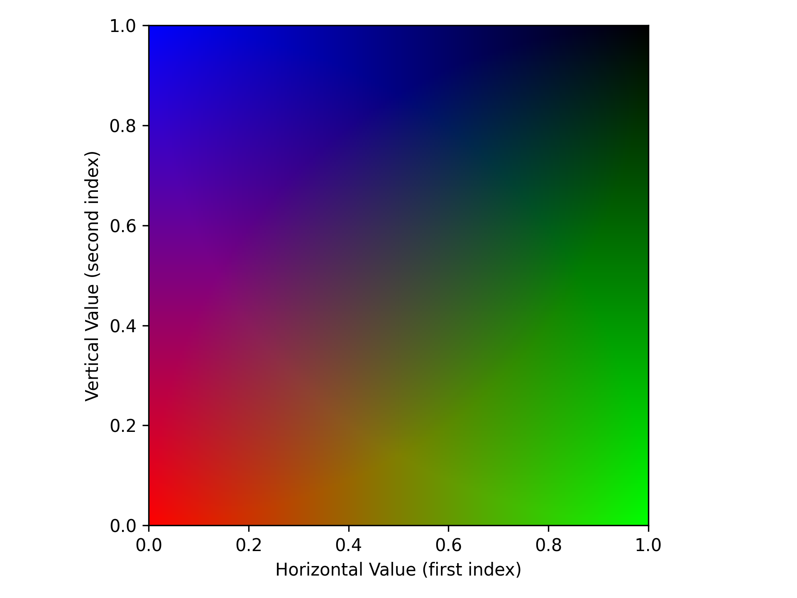
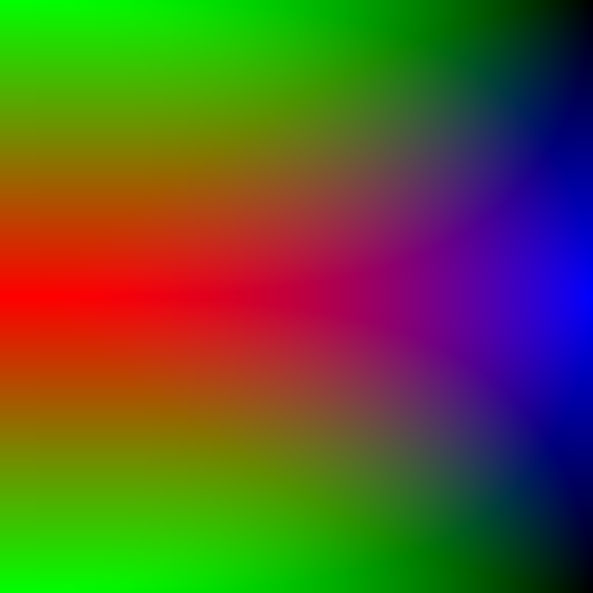
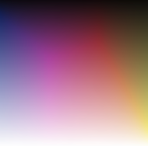
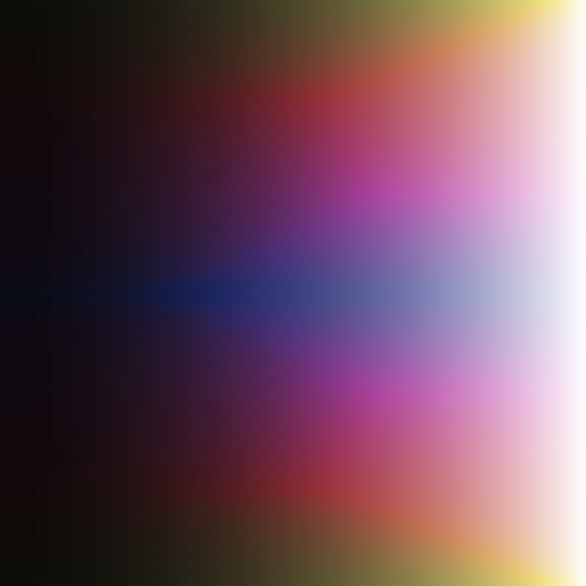

Tools
=====

:mod:`swiftsimio` includes a few tools to help you make your visualisations
'prettier'. Below we describe these tools and their use.

2D Color Maps
-------------

The :mod:`swiftsimio.visualisation.tools.cmaps` module includes three
objects that can be used to deploy two dimensional colour maps. The first,
:class:`swiftsimio.visualisation.tools.cmaps.LinearSegmentedCmap2D`, and second
:class:`swiftsimio.visualisation.tools.cmaps.LinearSegmentedCmap2DHSV`, allow
you to generate new color maps from sets of colors and coordinates.

.. code-block:: python

	bower = LinearSegmentedCmap2D(
		colors=[[1.0, 0.0, 0.0], [0.0, 1.0, 0.0], [0.0, 0.0, 1.0], [0.0, 0.0, 0.0]],
		coordinates=[[0.0, 0.0], [1.0, 0.0], [0.0, 1.0], [1.0, 1.0]],
		name="bower"
	)
	
This generates a color map that is a quasi-linear interpolation between all
of the points. The map can be displayed using the ``plot`` method,

.. code-block:: python

	fig, ax = plt.subplots()
	
	bower.plot(ax)
	
Which generates:

Finally, the color map can be applied to data by calling it:

.. code-block:: python

	def vertical_func(x):
		return abs(1.0 - 2.0 * x)
	
	def horizontal_func(y):
		return y ** 2
	
	raster_at = np.linspace(0, 1, 1024)
	
	x, y = np.meshgrid(horizontal_func(raster_at), vertical_func(raster_at))
	
	imaged = bower(x, y)
	
	plt.imsave("test_2d_cmap_output.png", imaged)
	
Where here ``imaged`` is an RGBA array. This outputs:

The final type of 2D color map is loaded from an image, such as the one displayed
below which is similar to the famous color map used for the Millenium simulation.

This can be loaded using the
:class:`swiftsimio.visualisation.tools.cmaps.ImageCmap2D` class, as follows:

.. code-block:: python
	
	mill = ImageCmap2D(filename="millenium_cmap.png")
	
and can be used similarly to the other color maps. For the example above, this
outputs the following:

This is the recommended way to use two dimensional color maps, as their
generation can be quite complex and best left to image-generation programs
such as GIMP or Photoshop.
