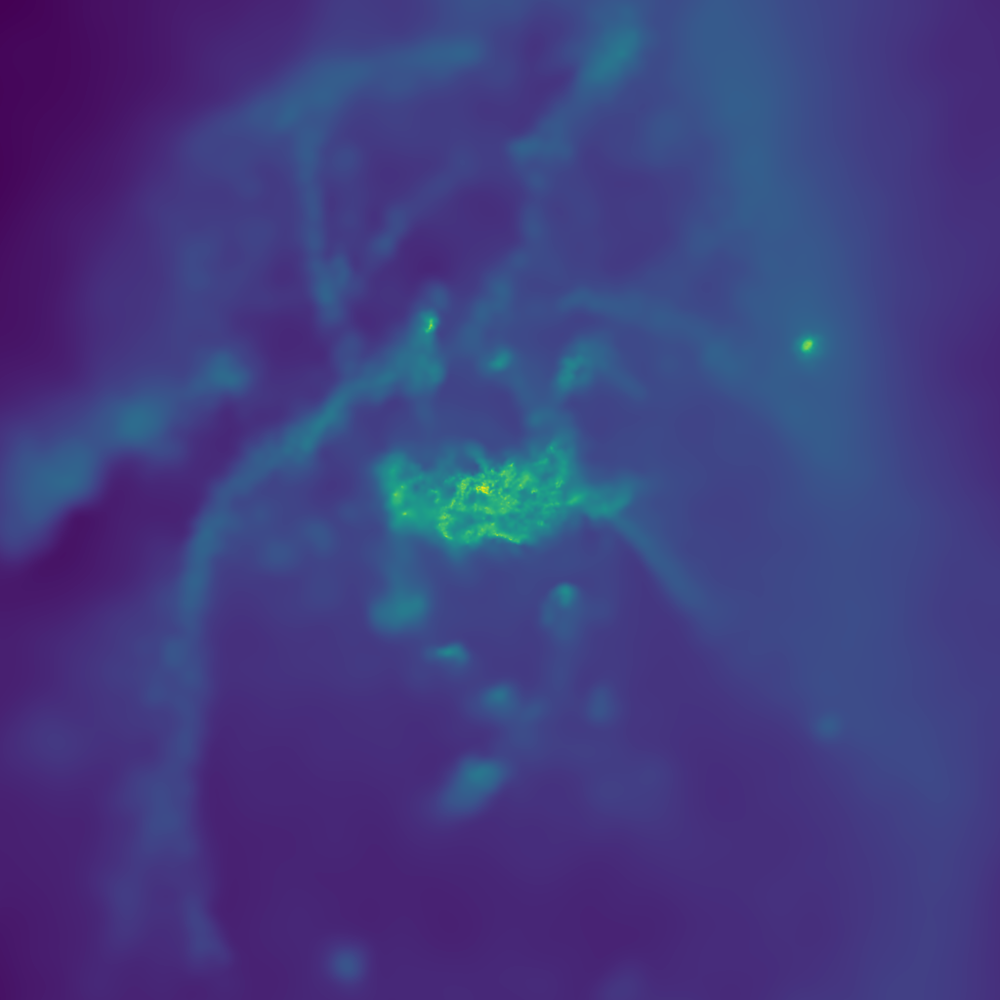
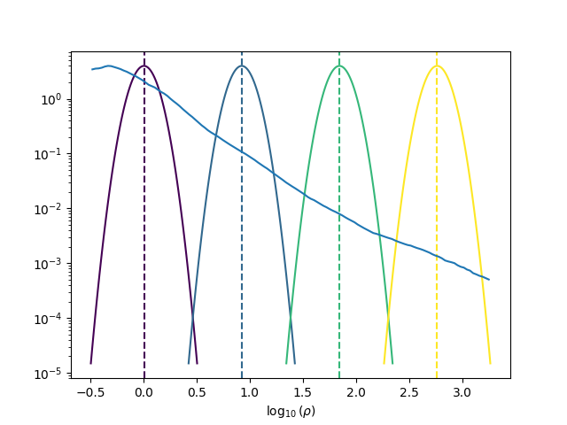

Volume Rendering
================

The :mod:`swiftsimio.visualisation.volume_render` sub-module provides an
interface to render SWIFT data onto a fixed grid. This takes your 3D data and
finds the 3D density at fixed positions, allowing it to be used in codes that
require fixed grids such as radiative transfer programs.

This effectively solves the equation:

:math:`\tilde{A}_i = \sum_j A_j W_{ij, 3D}`

with :math:`\tilde{A}_i` the smoothed quantity in pixel :math:`i`, and
:math:`j` all particles in the simulation, with :math:`W` the 3D kernel.
Here we use the Wendland-C2 kernel.

The primary function here is
:func:`swiftsimio.visualisation.volume_render.render_gas`, which allows you
to create a gas density grid of any field, see the example below.

Example
-------

.. code-block:: python

   from swiftsimio import load
   from swiftsimio.visualisation.volume_render import render_gas

   data = load("cosmo_volume_example.hdf5")

   # This creates a grid that has units msun / Mpc^3, and can be transformed like
   # any other unyt quantity.
   mass_grid = render_gas(
       data,
       resolution=256,
       project="masses",
       parallel=True,
       periodic=True,
   )

This basic demonstration creates a mass density cube.

To create, for example, a projected temperature cube, we need to remove the
density dependence (i.e. :func:`~swiftsimio.visualisation.volume_render.render_gas` returns a volumetric
temperature in units of K / kpc^3 and we just want K) by dividing out by
this:

.. code-block:: python

   from swiftsimio import load
   from swiftsimio.visualisation.volume_render import render_gas

   data = load("cosmo_volume_example.hdf5")

   # First create a mass-weighted temperature dataset
   data.gas.mass_weighted_temps = data.gas.masses * data.gas.temperatures

   # Map in msun / mpc^3
   mass_cube = render_gas(
       data,
       resolution=256,
       project="masses",
       parallel=True,
       periodic=True,
   )

   # Map in msun * K / mpc^3
   mass_weighted_temp_cube = render_gas(
       data,
       resolution=256,
       project="mass_weighted_temps",
       parallel=True,
       periodic=True,
   )

   # A 256 x 256 x 256 cube with dimensions of temperature
   temp_cube = mass_weighted_temp_cube / mass_cube

Periodic boundaries
-------------------

Cosmological simulations and many other simulations use periodic boundary
conditions. This has implications for the particles at the edge of the
simulation box: they can contribute to voxels on multiple sides of the image.
If this effect is not taken into account, then the voxels close to the edge
will have values that are too low because of missing contributions.

All visualisation functions by default assume a periodic box. Rather than
simply summing each individual particle once, eight additional periodic copies
of each particle are also taken into account. Most copies will contribute
outside the valid voxel range, but the copies that do not ensure that voxels
close to the edge receive all necessary contributions. Thanks to :mod:`numba`
optimisations, the overhead of these additional copies is relatively small.

There are some caveats with this approach. If you try to visualise a subset of
the particles in the box (e.g. using a mask), then only periodic copies of
particles in this subset will be used. If the subset does not include particles
on the other side of the periodic boundary, then these will still be missing
from the voxel cube. The same is true if you visualise a region of the box.
The periodic boundary wrapping is also not compatible with rotations (see below)
and should therefore not be used together with a rotation.

Rotations
---------

Rotations of the box prior to volume rendering are provided in a similar fashion 
to the :mod:`swiftsimio.visualisation.projection` sub-module, by using the 
:mod:`swiftsimio.visualisation.rotation` sub-module. To rotate the perspective
prior to slicing a ``rotation_center`` argument in :func:`~swiftsimio.visualisation.volume_render.render_gas` needs
to be provided, specifying the point around which the rotation takes place. 
The angle of rotation is specified with a matrix, supplied by ``rotation_matrix``
in :func:`~swiftsimio.visualisation.volume_render.render_gas`. The rotation matrix may be computed with 
:func:`~swiftsimio.visualisation.rotation.rotation_matrix_from_vector`. This will result in the perspective being 
rotated to be along the provided vector. This approach to rotations applied to 
the above example is shown below.

.. code-block:: python

   from swiftsimio import load
   from swiftsimio.visualisation.volume_render import render_gas
   from swiftsimio.visualisation.rotation import rotation_matrix_from_vector

   data = load("cosmo_volume_example.hdf5")

   # First create a mass-weighted temperature dataset
   data.gas.mass_weighted_temps = data.gas.masses * data.gas.temperatures

   # Specify the rotation parameters
   center = 0.5 * data.metadata.boxsize
   rotate_vec = [0.5,0.5,1]
   matrix = rotation_matrix_from_vector(rotate_vec, axis='z')
   
   # Map in msun / mpc^3
   mass_cube = render_gas(
       data,
       resolution=256,
       project="masses",
       rotation_matrix=matrix,
       rotation_center=center,
       parallel=True,
       periodic=False, # disable periodic boundaries for rotations
   )
   
   # Map in msun * K / mpc^3
   mass_weighted_temp_cube = render_gas(
       data, 
       resolution=256,
       project="mass_weighted_temps",
       rotation_matrix=matrix,
       rotation_center=center,
       parallel=True,
       periodic=False,
   )

   # A 256 x 256 x 256 cube with dimensions of temperature
   temp_cube = mass_weighted_temp_cube / mass_cube

Rendering
---------

We provide a volume rendering function that can be used to make images highlighting
specific density contours. The key function here is
:func:`swiftsimio.visualisation.volume_render.visualise_render`. This takes
in your volume rendering, along with a colour map and centers, to create
these highlights. The example below shows how to use this.

.. code-block:: python

   import matplotlib.pyplot as plt
   import numpy as np
   from matplotlib.colors import LogNorm
   
   from swiftsimio import load
   from swiftsimio.visualisation import volume_render
   
   # Load the data
   data = load("test_data/eagle_6.hdf5")
   
   # Rough location of an interesting galaxy in the volume.
   region = [
       0.225 * data.metadata.boxsize[0],
       0.275 * data.metadata.boxsize[0],
       0.12 * data.metadata.boxsize[1],
       0.17 * data.metadata.boxsize[1],
       0.45 * data.metadata.boxsize[2],
       0.5 * data.metadata.boxsize[2],
   ]
   
   # Render the volume (note 1024 is reasonably high resolution so this won't complete
   # immediately; you should consider using 256, etc. for testing).
   rendered = volume_render.render_gas(data, resolution=1024, region=region, parallel=True)
   
   # Quick view! By projecting along the final axis you can get
   # the projected density from the rendered image.
   plt.imsave("volume_render_quick_view.png", LogNorm()(rendered.sum(-1)))

Here we can see the quick view of this image. It's just a regular density projection:

.. code-block:: python
   
   # Now we will move onto the real volume rendering. Let's use the log of the density;
   # using the real density leads to low contrast images.
   log_rendered = np.log10(rendered)
   
   # The volume rendering function expects centers of 'bins' and widths. These
   # bins actually represent gaussian functions around a specific density (or other
   # visualization quantity). The brightest pixel value is at center. We will
   # visualise this later!
   width = 0.1
   std = np.std(log_rendered)
   mean = np.mean(log_rendered)
   
   # It's helpful to choose the centers relative to the data you have. When making
   # a movie, you will obviously want to choose the centers to be the same for each
   # frame.
   centers = [mean + x * std for x in [1.0, 3.0, 5.0, 7.0]]
   
   # This will visualize your render options. The centers are shown as gaussians and
   # vertical lines.
   fig, ax = volume_render.visualise_render_options(
       centers=centers, widths=width, cmap="viridis"
   )
   
   histogram, edges = np.histogram(
       log_rendered.flat,
       bins=128,
       range=(min(centers) - 5.0 * width, max(centers) + 5.0 * width),
   )
   bc = (edges[:-1] + edges[1:]) / 2.0
   
   # The normalization here is the height of a gaussian!
   ax.plot(bc, histogram / (np.max(histogram) * np.sqrt(2.0 * np.pi) * width))
   ax.semilogy()
   ax.set_xlabel("$\\log_{10}(\\rho)$")
   
   plt.savefig("volume_render_options.png")

This function :func:`swiftsimio.visualisation.volume_render.visualise_render_options` allows
you to see what densities your rendering is picking out:

.. code-block:: python   
   
   # Now we can really visualize the rendering.
   img, norms = volume_render.visualise_render(
       log_rendered,
       centers,
       widths=width,
       cmap="viridis",
   )
   
   # Sometimes, these images can be a bit dark. You can increase the brightness using
   # tools like PIL or in your favourite image editor.
   from PIL import Image, ImageEnhance
   
   pilimg = Image.fromarray((img * 255.0).astype(np.uint8))
   enhanced = ImageEnhance.Contrast(ImageEnhance.Brightness(pilimg).enhance(2.0)).enhance(
       1.2
   )
   
   enhanced.save("volume_render_example.png")

Which produces the image:

.. image:: volume_render_example.png

Once you have this base image, you can always use your photo editor to tweak it further.
In particular, open the 'levels' panel and play around with the sliders!

Lower-level API
---------------

The lower-level API for volume rendering allows for any general positions,
smoothing lengths, and smoothed quantities, to generate a pixel grid that
represents the smoothed, volume rendered, version of the data.

This API is available through
:func:`swiftsimio.visualisation.volume_render_backends.backends["scatter"]` and
:func:`swiftsimio.visualisation.volume_render_backends.backends_parallel["scatter"]` for the parallel
version. The parallel version uses significantly more memory as it allocates
a thread-local image array for each thread, summing them in the end. Here we
will only describe the ``scatter`` variant, but they behave in the exact same way.

To use this function, you will need:

+ x-positions of all of your particles, ``x``.
+ y-positions of all of your particles, ``y``.
+ z-positions of all of your particles, ``z``.
+ A quantity which you wish to smooth for all particles, such as their
  mass, ``m``.
+ Smoothing lengths for all particles, ``h``.
+ The resolution you wish to make your cube at, ``res``.

Optionally, you will also need:
+ the size of the simulation box in x, y and z, ``box_x``, ``box_y`` and ``box_z``.

The key here is that only particles in the domain [0, 1] in x, [0, 1] in y,
and [0, 1] in z. will be visible in the cube. You may have particles outside
of this range; they will not crash the code, and may even contribute to the
image if their smoothing lengths overlap with [0, 1]. You will need to
re-scale your data such that it lives within this range. You should pass in
raw numpy array (not :class:`~swiftsimio.objects.cosmo_array` or :class:`~unyt.array.unyt_array`).
Then you may use the function as follows:

.. code-block:: python

   from swiftsimio.visualisation.volume_render import scatter

   # Using the variable names from above
   out = scatter(x=x, y=y, z=z, h=h, m=m, res=res)

``out`` will be a 3D :class:`~numpy.ndarray` grid of shape ``[res, res, res]``. You will
need to re-scale this back to your original dimensions to get it in the
correct units, and do not forget that it now represents the smoothed quantity
per volume.

If the optional arguments ``box_x``, ``box_y`` and ``box_z`` are provided, they
should contain the simulation box size in the same re-scaled coordinates as 
``x``, ``y`` and ``z``. The rendering function will then correctly apply
periodic boundary wrapping. If ``box_x``, ``box_y`` and ``box_z`` are not
provided or set to 0, no periodic boundaries are applied.
