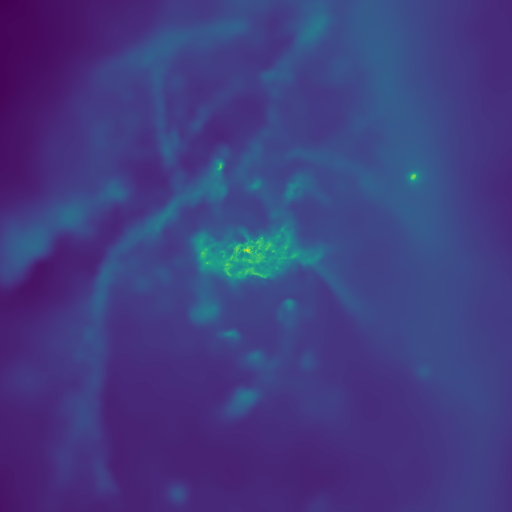
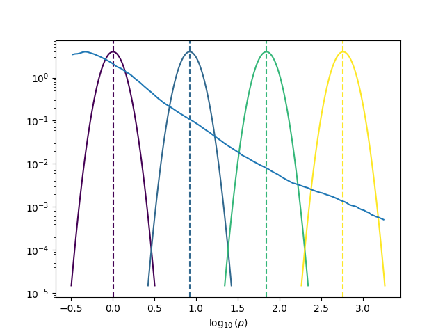
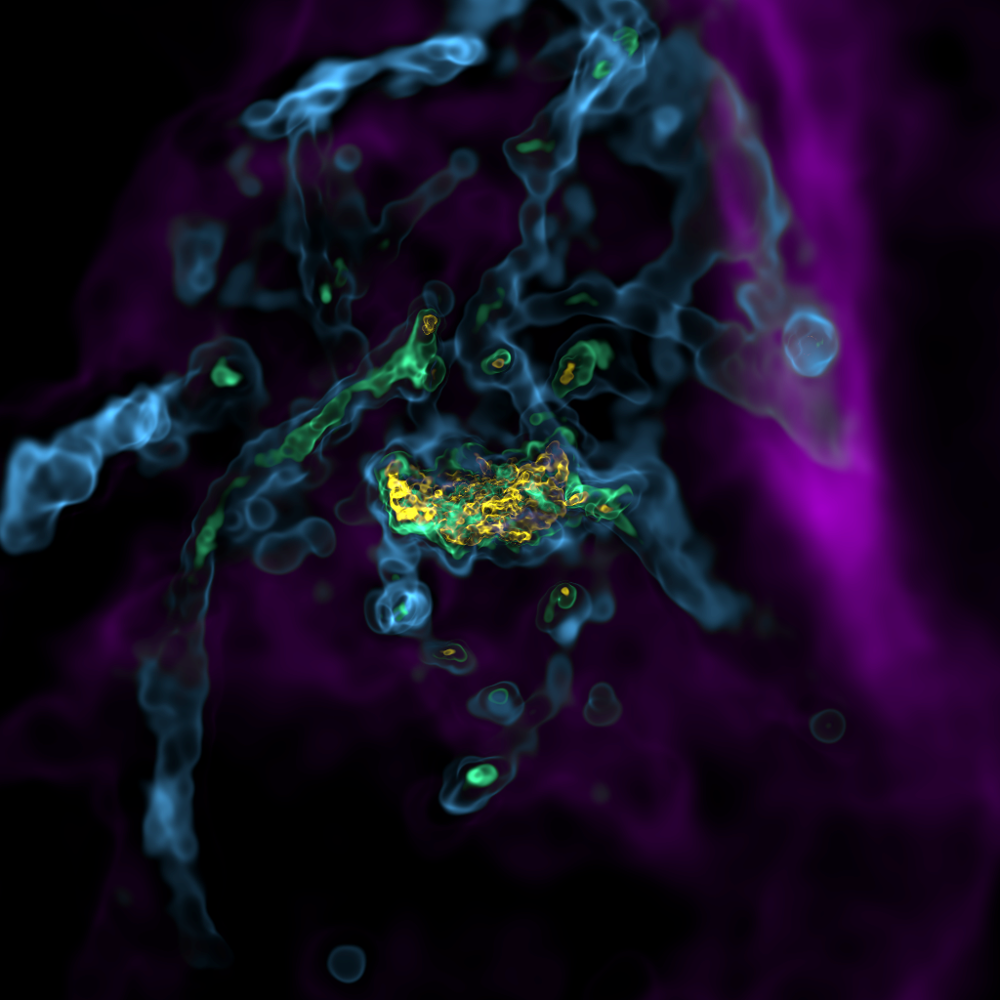

Volume Rendering
================

The :mod:`swiftsimio.visualisation.volume_render` sub-module provides an
interface to render SWIFT data onto a fixed grid. This takes your 3D data and
finds the 3D density at fixed positions, allowing it to be used in codes that
require fixed grids such as radiative transfer programs.

This effectively solves the equation:

:math:`\tilde{A}_i = \sum_j A_j W_{ij, 3D}`

with :math:`\tilde{A}_i` the smoothed quantity in pixel :math:`i`, and
:math:`j` all particles in the simulation, with :math:`W` the 3D kernel.
Here we use the Wendland-C2 kernel.

The primary functions here are
:func:`swiftsimio.visualisation.volume_render.render_voxel_grid`, which allows
you to create a voxel grid of any field for any particle type, and the
convenience wrapper :func:`swiftsimio.visualisation.volume_render.render_gas`
for gas particles. See the examples below.

Example
-------

.. code-block:: python

   from swiftsimio import load
   from swiftsimio.visualisation.volume_render import render_gas

   data = load("cosmo_volume_example.hdf5")

   # This creates a grid that has units msun / Mpc^3, and can be transformed like
   # any other unyt quantity.
   mass_grid = render_gas(
       data,
       resolution=256,
       project="masses",
       parallel=True,
       periodic=True,
   )

This basic demonstration creates a mass density cube.

To create, for example, a projected temperature cube, we need to remove the
density dependence (i.e. :func:`~swiftsimio.visualisation.volume_render.render_gas`
returns a volumetric temperature in units of K / kpc^3 and we just want K) by dividing
out by this:

.. code-block:: python

   from swiftsimio import load
   from swiftsimio.visualisation.volume_render import render_gas

   data = load("cosmo_volume_example.hdf5")

   # First create a mass-weighted temperature dataset
   data.gas.mass_weighted_temps = data.gas.masses * data.gas.temperatures

   # Map in msun / mpc^3
   mass_cube = render_gas(
       data,
       resolution=256,
       project="masses",
       parallel=True,
       periodic=True,
   )

   # Map in msun * K / mpc^3
   mass_weighted_temp_cube = render_gas(
       data,
       resolution=256,
       project="mass_weighted_temps",
       parallel=True,
       periodic=True,
   )

   # A 256 x 256 x 256 cube with dimensions of temperature
   temp_cube = mass_weighted_temp_cube / mass_cube

Periodic boundaries
-------------------

Cosmological simulations and many other simulations use periodic boundary
conditions. This has implications for the particles at the edge of the
simulation box: they can contribute to voxels on multiple sides of the image.
If this effect is not taken into account, then the voxels close to the edge
will have values that are too low because of missing contributions.

All visualisation functions by default assume a periodic box. Rather than
simply summing each individual particle once, eight additional periodic copies
of each particle are also taken into account. Most copies will contribute
outside the valid voxel range, but the copies that do not ensure that voxels
close to the edge receive all necessary contributions. Thanks to :mod:`numba`
optimisations, the overhead of these additional copies is relatively small.

There are some caveats with this approach. If you try to visualise a subset of
the particles in the box (e.g. using a mask), then only periodic copies of
particles in this subset will be used. If the subset does not include particles
on the other side of the periodic boundary, then these will still be missing
from the voxel cube. The same is true if you visualise a region of the box.
The periodic boundary wrapping is also not compatible with rotations (see below)
and should therefore not be used together with a rotation.

Rotations
---------

Rotations of the box prior to volume rendering are provided in a similar fashion
to the :mod:`swiftsimio.visualisation.projection` sub-module, by using the
:mod:`swiftsimio.visualisation.rotation` sub-module. To rotate the perspective
prior to slicing a ``rotation_center`` argument in
:func:`~swiftsimio.visualisation.volume_render.render_gas` needs
to be provided, specifying the point around which the rotation takes place.
The angle of rotation is specified with a matrix, supplied by ``rotation_matrix``
in :func:`~swiftsimio.visualisation.volume_render.render_gas`. The rotation matrix may
be computed with :func:`~swiftsimio.visualisation.rotation.rotation_matrix_from_vector`.
This will result in the perspective being rotated to be along the provided vector. This
approach to rotations applied to the above example is shown below.

.. code-block:: python

   from swiftsimio import load
   from swiftsimio.visualisation.volume_render import render_gas
   from swiftsimio.visualisation.rotation import rotation_matrix_from_vector

   data = load("cosmo_volume_example.hdf5")

   # First create a mass-weighted temperature dataset
   data.gas.mass_weighted_temps = data.gas.masses * data.gas.temperatures

   # Specify the rotation parameters
   center = 0.5 * data.metadata.boxsize
   rotate_vec = [0.5,0.5,1]
   matrix = rotation_matrix_from_vector(rotate_vec, axis='z')

   # Map in msun / mpc^3
   mass_cube = render_gas(
       data,
       resolution=256,
       project="masses",
       rotation_matrix=matrix,
       rotation_center=center,
       parallel=True,
       periodic=False,  # disable periodic boundaries for rotations
   )

   # Map in msun * K / mpc^3
   mass_weighted_temp_cube = render_gas(
       data,
       resolution=256,
       project="mass_weighted_temps",
       rotation_matrix=matrix,
       rotation_center=center,
       parallel=True,
       periodic=False,
   )

   # A 256 x 256 x 256 cube with dimensions of temperature
   temp_cube = mass_weighted_temp_cube / mass_cube

Masking
-------

Sometimes you want to render only a subset of a snapshot's data, for example
just particles belonging to a given friends-of-friends group.
To achieve this, you can provide a boolean mask to
:func:`~swiftsimio.visualisation.volume_render.render_pixel_grid` or
:func:`~swiftsimio.visualisation.volume_render.render_gas` to render only the
particles which the mask specifies.

.. code-block:: python

   from swiftsimio import load, mask, cosmo_array
   from swiftsimio.visualisation.volume_render import render_gas

   snapshot_filename = "cosmo_volume_example.hdf5"
   catalog_filename = "fof_output_example.hdf5"

   # Which halo are we looking at?
   halo = 0

   fof_catalog = load(catalog_filename)

   fof_id = fof_catalog.fof_groups.group_ids[halo]
   fof_radius = fof_catalog.fof_groups.radii[halo]
   fof_centre = fof_catalog.fof_groups.centres[halo]

   # Add some buffer space around the edges
   fof_radius *= 1.1

   # Define a region around the fof group
   region = cosmo_array(
       [
           [fof_centre[0] - fof_radius, fof_centre[0] + fof_radius],
           [fof_centre[1] - fof_radius, fof_centre[1] + fof_radius],
           [fof_centre[2] - fof_radius, fof_centre[2] + fof_radius],
       ],
       fof_centre.units,
       comoving=True,
       scale_factor=fof_catalog.metadata.a,
       scale_exponent=1,
   )

   # Only load data in our region of interest
   data_mask = mask(snapshot_filename)
   data_mask.constrain_spatial(region)

   data = load(snapshot_filename, mask=data_mask)

   halo_render = render_gas(
       data,
       resolution=512,
       parallel=True,
       region=region.ravel(),
       periodic=True,
       mask=data.gas.fofgroup_id == fof_id, # Only render particles in the group
   )

Other particle types
--------------------

Other particle types can be volume rendered using
:func:`swiftsimio.visualisation.volume_render.render_voxel_grid`.

For particle types that do not have smoothing lengths (e.g. dark matter),
you will need to generate them first using
:func:`~swiftsimio.visualisation.smoothing_length.generate.generate_smoothing_lengths`.

.. code-block:: python

   from swiftsimio import load
   from swiftsimio.visualisation.volume_render import render_voxel_grid
   from swiftsimio.visualisation.smoothing_length import generate_smoothing_lengths

   data = load("cosmo_volume_example.hdf5")

   # Generate smoothing lengths for the dark matter
   data.dark_matter.smoothing_length = generate_smoothing_lengths(
       data.dark_matter.coordinates,
       data.metadata.boxsize,
       kernel_gamma=1.8,
       neighbours=57,
       speedup_fac=2,
       dimension=3,
   )

   # Render the dark matter mass
   dm_mass_cube = render_voxel_grid(
       # Pass the dark matter dataset, not the whole data object
       data=data.dark_matter,
       resolution=256,
       project="masses",
       parallel=True,
       periodic=True,
   )

   from matplotlib.pyplot import imsave
   from matplotlib.colors import LogNorm

   imsave("dm_mass_cube_projection.png", LogNorm()(dm_mass_cube.sum(-1).value), cmap="inferno")

Rendering
---------

We provide a volume rendering function that can be used to make images highlighting
specific density contours. The key function here is
:func:`swiftsimio.visualisation.volume_render.visualise_render`. This takes
in your volume rendering, along with a colour map and centers, to create
these highlights. The example below shows how to use this.

.. code-block:: python

   import matplotlib.pyplot as plt
   import numpy as np
   from matplotlib.colors import LogNorm

   from swiftsimio import load
   from swiftsimio.visualisation import volume_render

   # Load the data
   data = load("eagle_6.hdf5")

   # Rough location of an interesting galaxy in the volume.
   region = [
       0.225 * data.metadata.boxsize[0],
       0.275 * data.metadata.boxsize[0],
       0.12 * data.metadata.boxsize[1],
       0.17 * data.metadata.boxsize[1],
       0.45 * data.metadata.boxsize[2],
       0.5 * data.metadata.boxsize[2],
   ]

   # Render the volume (note 1024 is reasonably high resolution so this won't complete
   # immediately; you should consider using 256, etc. for testing).
   rendered = volume_render.render_gas(
       data, resolution=1024, region=region, parallel=True
   )

   # Quick view! By projecting along the final axis you can get
   # the projected density from the rendered image.
   plt.imsave("volume_render_quick_view.png", LogNorm()(rendered.sum(-1)))

Here we can see the quick view of this image. It's just a regular density projection:

.. code-block:: python

   # Now we will move onto the real volume rendering. Let's use the log of the density;
   # using the real density leads to low contrast images.
   log_rendered = np.log10(rendered)

   # The volume rendering function expects centers of 'bins' and widths. These
   # bins actually represent gaussian functions around a specific density (or other
   # visualization quantity). The brightest pixel value is at center. We will
   # visualise this later!
   width = 0.1
   std = np.std(log_rendered)
   mean = np.mean(log_rendered)

   # It's helpful to choose the centers relative to the data you have. When making
   # a movie, you will obviously want to choose the centers to be the same for each
   # frame.
   centers = [mean + x * std for x in [1.0, 3.0, 5.0, 7.0]]

   # This will visualize your render options. The centers are shown as gaussians and
   # vertical lines.
   fig, ax = volume_render.visualise_render_options(
       centers=centers, widths=width, cmap="viridis"
   )

   histogram, edges = np.histogram(
       log_rendered.flat,
       bins=128,
       range=(min(centers) - 5.0 * width, max(centers) + 5.0 * width),
   )
   bc = (edges[:-1] + edges[1:]) / 2.0

   # The normalization here is the height of a gaussian!
   ax.plot(bc, histogram / (np.max(histogram) * np.sqrt(2.0 * np.pi) * width))
   ax.semilogy()
   ax.set_xlabel("$\\log_{10}(\\rho)$")

   plt.savefig("volume_render_options.png")

This function :func:`swiftsimio.visualisation.volume_render.visualise_render_options`
allows you to see what densities your rendering is picking out:

.. code-block:: python

   # Now we can really visualize the rendering.
   img, norms = volume_render.visualise_render(
       log_rendered,
       centers,
       widths=width,
       cmap="viridis",
   )

   # Sometimes, these images can be a bit dark. You can increase the brightness using
   # tools like PIL or in your favourite image editor.
   from PIL import Image, ImageEnhance

   pilimg = Image.fromarray((img * 255.0).astype(np.uint8))
   enhanced = ImageEnhance.Contrast(ImageEnhance.Brightness(pilimg).enhance(2.0)).enhance(
       1.2
   )

   enhanced.save("volume_render_example.png")

Which produces the image:

Once you have this base image, you can always use your photo editor to tweak it further.
In particular, open the 'levels' panel and play around with the sliders!

Backends
--------

Two scatter backends are available, selected via the ``backend`` argument to
:func:`~swiftsimio.visualisation.volume_render.render_voxel_grid` and
:func:`~swiftsimio.visualisation.volume_render.render_gas`:

* ``"scatter"`` — the default, standard single-resolution backend.
* ``"nested"`` — the nested multi-resolution backend, described in detail
  below. This is faster for simulations with a wide range of smoothing
  lengths, such as zoom-in runs or boxes containing both high-density gas
  and diffuse IGM.

.. code-block:: python

   from swiftsimio import load
   from swiftsimio.visualisation.volume_render import render_gas

   data = load("cosmo_volume_example.hdf5")

   # Standard backend
   mass_grid_standard = render_gas(
       data,
       resolution=256,
       project="masses",
       parallel=True,
       backend="scatter",  # the default
   )

   # Nested backend — faster for wide smoothing-length distributions.
   mass_grid_nested = render_gas(
       data,
       resolution=256,
       project="masses",
       parallel=True,
       backend="nested",
       ntarget=6,    # target voxels per kernel diameter at each level
       nlevels=4,    # number of coarsening levels (requires res % 2**nlevels == 0)
   )

Nested multi-resolution backend
~~~~~~~~~~~~~~~~~~~~~~~~~~~~~~~~

Motivation
^^^^^^^^^^

In the standard scatter backend every particle visits every voxel within its
kernel compact-support radius. For a particle whose smoothing length spans
:math:`N` voxels in each dimension, the cost is :math:`\mathcal{O}(N^3)`.
Simulations with large dynamic ranges in smoothing length — zoom-in
simulations, or cosmological volumes that include both dense filaments and
low-density IGM — contain particles whose kernels span tens or hundreds of
voxels. These few large particles can completely dominate the total rendering
time even though they represent only a tiny fraction of the particle count.

The nested backend bounds the per-particle cost at
:math:`\mathcal{O}(n_\mathrm{target}^3)` regardless of smoothing length by
scattering large particles onto a coarser grid and trilinearly upsampling
the result back to the finest grid afterwards. This follows the Sparse
Multi-Scale Grid approach described in `Benítez-Llambay (2025)`_.
The same algorithm is also available for 2D projections as
``backend="nested"`` (see :doc:`projection`).

.. _Benítez-Llambay (2025): https://iopscience.iop.org/article/10.3847/2515-5172/addab2

Algorithm
^^^^^^^^^

The pipeline has four stages.

**1. Level assignment.**
For each particle, the number of finest-grid cells spanned by its kernel
compact-support radius is estimated:

.. math::

   N_\mathrm{cells} = \gamma_k \, h \, r

where :math:`\gamma_k = 1.936492` is the Wendland-C2 kernel gamma and
:math:`r` is ``res``. The particle is then assigned to hierarchy level
:math:`L`:

.. math::

   L = \mathrm{clip}\!\left(\left\lceil \log_2 \frac{N_\mathrm{cells}}{n_\mathrm{target}} \right\rceil,\; 0,\; L_\mathrm{max}\right)

Level 0 is the finest grid (resolution ``res``); level :math:`L` uses a grid
of resolution :math:`r / 2^L`. At their assigned level every kernel spans
approximately ``ntarget`` voxels per axis, keeping the number of voxels
visited per particle bounded.

The hierarchy for ``res=512``, ``nlevels=4`` looks like this::

   Level 0 (finest)    512 × 512 × 512   — small, well-resolved kernels
   Level 1             256 × 256 × 256
   Level 2             128 × 128 × 128
   Level 3              64 ×  64 ×  64
   Level 4 (coarsest)   32 ×  32 ×  32   — very large, diffuse kernels

**2. Scatter.**
Each particle is scattered onto its assigned level using the 3-D Wendland-C2
kernel — the same kernel used by the standard backend. Periodic wrapping is
handled identically: particles are deposited once per periodic image whose
kernel support overlaps ``[0, 1]``. Level-0 particles write directly into the
finest output grid; coarser particles write into a flat array that stores all
coarse levels back-to-back.

**3. Collapse.**
After all particles have been deposited, the hierarchy is collapsed
coarse-to-fine (from level :math:`L_\mathrm{max}` down to level 1). Each
coarse cell is trilinearly upsampled and its contribution added to the next
finer grid. The upsampling stencil is::

   fine index 2i   draws 3/4 from coarse[i] and 1/4 from coarse[i-1]
   fine index 2i+1 draws 3/4 from coarse[i] and 1/4 from coarse[i+1]

applied independently in each of x, y, z, giving a separable
trilinear interpolation. Only the bounding box of voxels that actually
received mass is upsampled at each level, so the collapse cost scales
approximately with the number of particles rather than the grid volume.

**4. Return.**
The finest grid, which now contains contributions from all levels, is
returned as the output.

Accuracy
^^^^^^^^

The nested backend is an approximation: a particle at level :math:`L > 0`
deposits mass onto a coarser grid and that mass is then spread across the fine
grid by trilinear upsampling. The smoothed field seen by the finest grid is
therefore a convolution of the true kernel with the upsampling stencil. For
typical ``ntarget`` values of 4–10 the error in the reconstructed density
field is at the few-percent level in individual voxels.

A subtler source of per-voxel differences arises from floating-point
arithmetic. When the same snapshot is rendered with different region bounds or
at different absolute resolutions, normalised particle positions differ in
float64, and a particle very close to a voxel boundary can land in different
cells. This affects roughly 2–3% of voxels and produces large relative errors
in those cells (which individually carry very little mass). If per-voxel
fidelity at the sub-percent level matters, either increase ``ntarget`` or use
the standard ``"scatter"`` backend.

Neither backend renormalises its kernels, so integrated quantities such as
the total mass are conserved to about the same (percent-level) accuracy in
both.

Resolution constraint
^^^^^^^^^^^^^^^^^^^^^

Because each level coarsens by exactly a factor of two, ``res`` must be
divisible by :math:`2^{\text{nlevels}}`. With the default ``nlevels=4`` this
requires ``res`` to be a multiple of 16 (e.g. 128, 256, 512, 1024). Passing
an incompatible combination raises a ``ValueError`` with a suggestion of the
nearest valid ``res`` and the maximum supported ``nlevels`` for the given
``res``.

Memory usage
^^^^^^^^^^^^

The nested backend allocates one finest grid (:math:`r^3` float32 values) plus
a flat array for all coarse levels combined. The coarse array has total size

.. math::

   \sum_{L=1}^{L_\mathrm{max}} (r / 2^L)^3
   = r^3 \sum_{L=1}^{L_\mathrm{max}} 8^{-L}
   < \frac{r^3}{7}

so the total memory footprint is less than :math:`8/7` of the finest grid —
roughly 15% more than the standard backend, and independent of ``nlevels``.
In the parallel implementation each thread holds its own private copy of this
allocation, so peak memory scales with the number of threads.

When to use each backend
^^^^^^^^^^^^^^^^^^^^^^^^^

Use the standard ``"scatter"`` backend when:

* All particles have similar smoothing lengths (uniform-resolution boxes).
* You need exact per-voxel results with no upsampling approximation.
* Memory per thread is a constraint and thread count is high.

Use the ``"nested"`` backend when:

* The simulation has a wide dynamic range in smoothing lengths (zoom-in runs,
  cosmological boxes with IGM gas, multi-phase ISM models).
* A handful of very large kernels are making ``"scatter"`` slow.
* A few-percent approximation error in individual voxels is acceptable.

Choosing ``ntarget`` and ``nlevels``
^^^^^^^^^^^^^^^^^^^^^^^^^^^^^^^^^^^^^

``ntarget`` controls the number of voxels each kernel spans at its assigned
level. Higher values keep particles on finer grids (less upsampling, higher
accuracy) at the cost of more kernel evaluations. The default of 6 is a good
all-round choice; values in the range 4–10 span the practical speed/accuracy
trade-off.

``nlevels`` sets the depth of the hierarchy. More levels allow very large
kernels to be placed on very coarse grids, giving larger speedups for
extremely diffuse particles. The cost is a stricter divisibility requirement
on ``res``. In practice ``nlevels=4`` (the default) is sufficient for all but
the most extreme smoothing-length distributions.

.. code-block:: python

   # Default parameters — good starting point for most simulations.
   grid = render_gas(
       data,
       resolution=512,
       project="masses",
       parallel=True,
       periodic=True,
       backend="nested",
   )

   # Higher accuracy: fewer particles pushed to coarse levels.
   grid_accurate = render_gas(
       data,
       resolution=512,
       project="masses",
       parallel=True,
       periodic=True,
       backend="nested",
       ntarget=10,
       nlevels=4,
   )

   # Maximum speed: more levels, smaller ntarget.
   # Requires res divisible by 2**5 = 32.
   grid_fast = render_gas(
       data,
       resolution=512,
       project="masses",
       parallel=True,
       periodic=True,
       backend="nested",
       ntarget=4,
       nlevels=5,
   )

Lower-level API
---------------

The lower-level API for volume rendering allows for any general positions,
smoothing lengths, and smoothed quantities, to generate a pixel grid that
represents the smoothed, volume rendered, version of the data.

This API is available through
:obj:`swiftsimio.visualisation.volume_render_backends.backends` and
:obj:`swiftsimio.visualisation.volume_render_backends.backends_parallel` for parallel
implementations. The parallel versions use significantly more memory as they allocate
a thread-local image array for each thread, summing them in the end.

To use this function, you will need:

+ x-positions of all of your particles, ``x``.
+ y-positions of all of your particles, ``y``.
+ z-positions of all of your particles, ``z``.
+ A quantity which you wish to smooth for all particles, such as their
  mass, ``m``.
+ Smoothing lengths for all particles, ``h``.
+ The resolution you wish to make your cube at, ``res``.

Optionally, you will also need:

+ the size of the simulation box in x, y and z, ``box_x``, ``box_y`` and ``box_z``.

The key here is that only particles in the domain [0, 1] in x, [0, 1] in y,
and [0, 1] in z. will be visible in the cube. You may have particles outside
of this range; they will not crash the code, and may even contribute to the
image if their smoothing lengths overlap with [0, 1]. You will need to
re-scale your data such that it lives within this range. You should pass in
raw numpy array (not :class:`~swiftsimio.objects.cosmo_array` or
:class:`~unyt.array.unyt_array`). Then you may use the function as follows:

.. code-block:: python

   from swiftsimio.visualisation.volume_render_backends import backends, backends_parallel

   # Standard single-resolution scatter (serial).
   out = backends["scatter"](x=x, y=y, z=z, h=h, m=m, res=res)

   # Nested multi-resolution scatter (serial).
   out = backends["nested"](
       x=x,
       y=y,
       z=z,
       h=h,
       m=m,
       res=res,
       ntarget=6,
       nlevels=4,
   )

   # Parallel variants — use the same keyword arguments.
   out = backends_parallel["scatter"](x=x, y=y, z=z, h=h, m=m, res=res)
   out = backends_parallel["nested"](
       x=x,
       y=y,
       z=z,
       h=h,
       m=m,
       res=res,
       ntarget=6,
       nlevels=4,
   )

``out`` will be a 3D :class:`~numpy.ndarray` grid of shape ``[res, res, res]``. You will
need to re-scale this back to your original dimensions to get it in the
correct units, and do not forget that it now represents the smoothed quantity
per volume.

If the optional arguments ``box_x``, ``box_y`` and ``box_z`` are provided, they
should contain the simulation box size in the same re-scaled coordinates as
``x``, ``y`` and ``z``. The rendering function will then correctly apply
periodic boundary wrapping. If ``box_x``, ``box_y`` and ``box_z`` are not
provided or set to 0, no periodic boundaries are applied.
